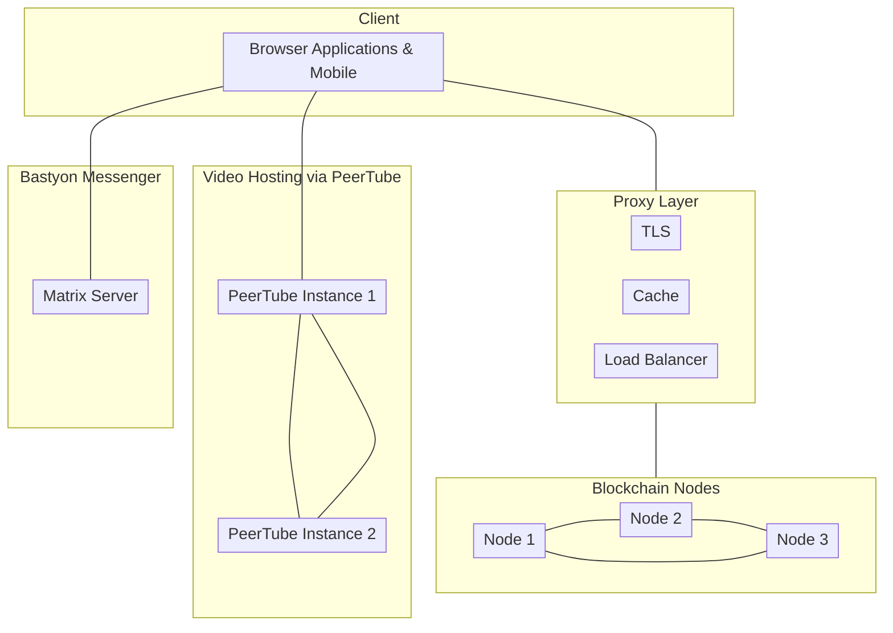

# Platform overview
 
Welcome to Bastyon developer documentation. Here you will find a lot of useful information, including how to get started, platform architectural overview, as well as the API reference.

Bastyon is an innovative, open-source social network and video sharing platform designed to prioritize freedom of speech and user privacy. Unlike mainstream social networks, Bastyon operates without centralized corporate control, instead relying on a distributed network of nodes worldwide. For more information, you can check out [get started](/get-started.md) section of the documentation.

> **Vision:**
Bastyon aims to create a resilient, decentralized ecosystem that empowers individuals with unrestricted access to communication, information, and personal data management. Our vision is to build a platform that stands strong against censorship and ensures user sovereignty in the digital realm.

The platform operates on a distributed network of nodes running the Bastyon blockchain, which is based on a randomized Proof-of-Stake algorithm. This decentralized architecture ensures that no single entity can control or censor the platform.
Cryptocurrency Integration.
Bastyon utilizes its native cryptocurrency, [PKOIN](https://www.coingecko.com/en/coins/pocketcoin+), for incentivizing content creators and node operators.


## Architecture and Design

The application flow architecture largerly depends on the content, users are interacting with. From a high-level, the architecture of Bastyon looks like the following:


<!-- bastyon-architecture-overview diagram mermaid code 


-->
<!-- Add more architectural detail as needed -->

<!-- todo
Describe the Bastyon implementaiton in terms of its building blocks. It should be high-level, explaining the architecture diagram from above in a bit more detail.
-->


## Development Repositories

The Bastyon Platform is roughly broken down into Roadmap (new ideas and the roadmap for the ideas that made it out of the ideation phase), documentation, front-end component (Mobile Apps, Desktop and Web Browser App), the back-end component (Node Software, Blockchain Explorer, Bastyion Platform API and todo: what is control?)

Below are the repositories for each respective platform components
<!--
[todo] provide detailed descriptions for each repo
-->
### Bastyon Project Overview 
[https://github.com/pocketnetteam/get.started](https://github.com/pocketnetteam/get.started)

[work tracking this](https://github.com/pocketnetteam/get.started/issues/1)

### Roadmap 
[https://github.com/pocketnetteam/roadmap](https://github.com/pocketnetteam/roadmap)

[work tracking this](https://github.com/pocketnetteam/roadmap/issues/1)

### Documentation

[https://github.com/pocketnetteam/documentation](https://github.com/pocketnetteam/documentation)


### Front-end

#### Bastyon Application UI

[https://github.com/pocketnetteam/pocketnet.gui](https://github.com/pocketnetteam/pocketnet.gui)


#### Bastyon Video Implementation
[https://github.com/pocketnetteam/bastyon-video](https://github.com/pocketnetteam/bastyon-video)

#### Bastyon Messenger UI

[https://github.com/pocketnetteam/bastyon-chat](https://github.com/pocketnetteam/bastyon-video)

#### Bastyon Calls UI 

[https://github.com/pocketnetteam/bastyon-calls](https://github.com/pocketnetteam/bastyon-video)


### Back-end

[https://github.com/pocketnetteam/pocketnet.core](https://github.com/pocketnetteam/pocketnet.core)

[https://github.com/pocketnetteam/pocketnet.explorer](https://github.com/pocketnetteam/pocketnet.explorer)

[https://github.com/pocketnetteam/pocketnet.api](https://github.com/pocketnetteam/pocketnet.api)

[https://github.com/pocketnetteam/pocketnet.control](https://github.com/pocketnetteam/pocketnet.control)


#### Blockchain and Node Network


## Quick start guide

### How do I Build a Node, locally?

[Coming soon]

### How do I build Desktop Application UI locally?

[Coming soon]

### How do I build Messenger, locally?

[Coming soon]

<!-- Add other howtos as needed -->


## Bastyon Moderation

### Flags

Reports allow users to flag content as objectionable (post or comment and author). Reports can be sent by users with the "Shark" badge (see API).

The numeric value `REASON` is used to distinguish between complaints:

1. Pornography
2. Pedophilia - any even remotely suggestive images/videos/texts with children or adolescents
3. Direct threat of violence
4. Illegal narcotics - any positive or promotion of illegal narcotics
5. Copyrighted content (with clear proof from the owner)


#### Conditions for creating a jury

Any flag can initiate the creation of a "jury". If the jury is initiated, all subsequent flags are ignored. To create a jury, the following rules are taken into account:

- The account in question is not in an active ban
- Number of flags with the same `REASON`, `CONTENT_TX_HASH` and `ADDRESS_HASH` must be `>= [main:20, test:5, reg:2]`
- Search depth for similar flags `FLAG_HEIGHT > (CURRENT_HEIGHT - [main:43200, test:4320, reg:10])`


### Transaction

`OP_RETURN` code

`6d6f64466c6167`


#### Payload structure
```json
{
    "s2": "<CONTENT_TX_HASH>",
    "s3": "<ADDRESS_HASH>",
    "i1": "<REASON>"
}
```


### Jury

The jury is not a transaction, it is a record in the database and contains the following fields:

- `juryid` - Hash of the Flag that initiates the creation of the jury.
- `accountid` - Address of the account, the author of the content.
- `reason` - Numerical code of the reason for the complaint.

Together with the jury's entry, the moderators are selected:

- To filter the list of moderators, the transaction hash of the `FLAG_HASH` flag that initiated the creation of the jury is used.
- The hash of the moderator account registration transaction `ACCOUNT_HASH` is used as moderator sorting.
- To decide the jury's question, TM accounts `[main:80, test:6 reg:4]` are selected
- For an even distribution of moderators, accounts are selected according to the following conditions:
  * Selected TM/2 accounts where `ACCOUNT_HASH < FLAG_HASH`
  * Selected TM/2 accounts where `ACCOUNT_HASH > FLAG_HASH`


### Vote

The moderator's vote, which has two values `0|1` indicating whether the moderator agrees with the complaints or not. Any vote may initiate a jury verdict.

- The verdict is positive if the vote satisfies the condition that it is the Nth positive vote `[main:8, test:3, reg:2]`.
- A negative verdict is issued along with the first negative vote of any moderator.
- After a verdict (positive or negative) is passed, all votes are ignored.
- A jury without a verdict is indefinite.

#### Transaction

`OP_RETURN` code

`6d6f64566f7465`


#### Payload structure
```json
{
    "s2": "<JURY_ID>",
    "i1": "<VERDICT>"
}
```

`JURY_ID` - hash of the flag transaction that initiated the jury

`VERDICT` - numeric value `0|1`


### Ban Account

An account ban, like a jury, is not a transaction. It is a record in the database and contains the following fields:

- Link to the voice initiating the blocking.
- Link to the account, the author of the content.
- Height of the end of blocking. The blocking period is determined based on the rules:
  * First lock - `[main:43200, test:5000, reg:100]` blocks
  * Second lock - `[main:129600, test:10000, reg:200]` blocks
  * Third lock - `[main:51840000, test:15000, reg:1000]` blocks

An account blocked by a node is not allowed to create Social transactions, but can create monetary transactions without restrictions.

Other accounts have the right to perform actions with a blocked account (put ratings, comments, etc.).


>***Rules for hiding content and accounts #In developing#***: Accounts that are in the active jury, banned or have N active complaints should be hidden from the feed and search.


### API

#### Badges definition

The `getuserstate` method returns, among other things, a `badges` object with a list of "badges" available to the user:

```json
> /rpc/getuserstate <address>

{
    "result": "success",
    "data": {
        ...
        "badges": [
            "shark",
            "moderator",
            "developer"
        ],
        ...
    }
}
```


#### List of all jury

```json
> /rpc/getalljury

{
    "result": "success",
    "data": [
      {
        "id": "HASH",
        "address": "Address of profile",
        "reason": "REASON numeric value",
        "verdict": "Verdict - 0 or 1"
      },
      ...
    ]
}
```


#### List of assigned jury for the moderator

```json
> /rpc/getjuryassigned <address> <verdict - 0|1> <topHeight> <pageStart> <pageSize> <orderBy> <desc>

{
  "result": "success",
  "data": [
    {
      "hash": "9f6cb0d0cd57d6227f38d70840eae89971bf44c74e4082914f9fd641dc573e52",
      "txid": "e32rr0d0cd57d6227f38d70840eae89971bf44c74e4082914f9fd641dc573e52",
      "id": 32,
      "address": "mzaEy5FGymhhk8bZd2NbeZiecW8ZLtVceb",
      ...
      "versions": [
          {
              "h": 1054,
              "hs": "e32rr0d0cd57d6227f38d70840eae89971bf44c74e4082914f9fd641dc573e52"
          }
      ],
      "jury": {
        "juryid": "5435230506fcb1951fd0e7384fb7cad5659a154856dd10258a8d77f243507f07",
        "height": 1064,
        "reason": 1
      }
    },
    ...
  ]
}
```

Here `versions` this is a list of transaction hashes of the edited versions of the content.


#### List of moderators assigned in the specified jury

```json
> /rpc/getjurymoderators <juryid>

{
    "result": "success",
    "data": [
      "Address of profile",
      "Address of profile",
      ...
    ]
}
```


#### List of bans for specific address

```json
> /rpc/getbans <address>

{
  "result": "success",
    "data": [
      {
        "juryId": "HASH",
        "contentId": "HASH",
        "reason": 1,
        "ending": 2500000
      },
      {
        "juryId": "HASH",
        "contentId": "HASH",
        "reason": 2,
        "ending": 2600000
      },
      ...
    ]
}
```


#### List of bans for specific address

```json
> /rpc/getbans <address>

{
  "result": "success",
    "data": [
      {
        "juryId": "HASH",
        "reason": 1,
        "ending": 2500000
      },
      {
        "juryId": "HASH",
        "reason": 2,
        "ending": 2600000
      },
      ...
    ]
}
```


#### Get specific version of content

```json
> /rpc/getcontent ["HASH", "HASH", ...] <address> <LAST - 0|1>

{
  "result": "success",
    "data": [
      ...
    ]
}
```


#### Notify about new jury assigned to author of content

`txid` - Flag transaction ID and Jury ID

```json
{
	"addr": "TG69Jioc81PiwMAJtRanfZqUmRY4TUG7nt",
	"msg": "event",
	"txid": "0080c9a54b94b7e0602486e41c18a8f54bf3ed4b29508dbef58c20021fd5852d",
	"time": 1706521030,
	"contentHash": "cb4866f11e1ba2087364600fcd0c316373639e18223da63ddd9b6115e2313088",
	"contentRootHash": "cb4866f11e1ba2087364600fcd0c316373639e18223da63ddd9b6115e2313088",
	"contentType": "200",
	"mesType": "juryassigned",
	"reason": "2"
}
```

#### Notify about new ban for account

```json
{
  "addr": "TLAvSHoNbeECY9S6Z7WBMyDT64WWHLm8d7",
  "msg": "event",
  "txid": "84858578a2ec42069dc4a0eb752c2d16229e52f65f1ccfd6de3bc77899eef71f",
  "time": 1706522294,
  "contentHash": "9a3f634be04c6ac190d01ca376711190925b819314c8dfa0753533a87ef87dea",
  "contentRootHash": "9a3f634be04c6ac190d01ca376711190925b819314c8dfa0753533a87ef87dea",
  "contentType": "200",
  "juryHash": "aeb2e47fb6dec5ebcb91299627e3f87ab37d60997f8a17c16972a4660e3de696",
  "mesType": "juryverdict",
  "reason": "1"
}
```

## Best practices and examples

## Tutorials
