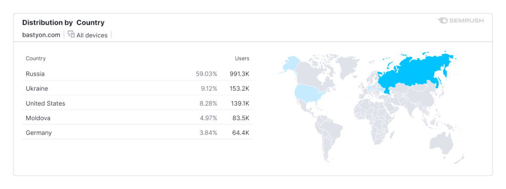
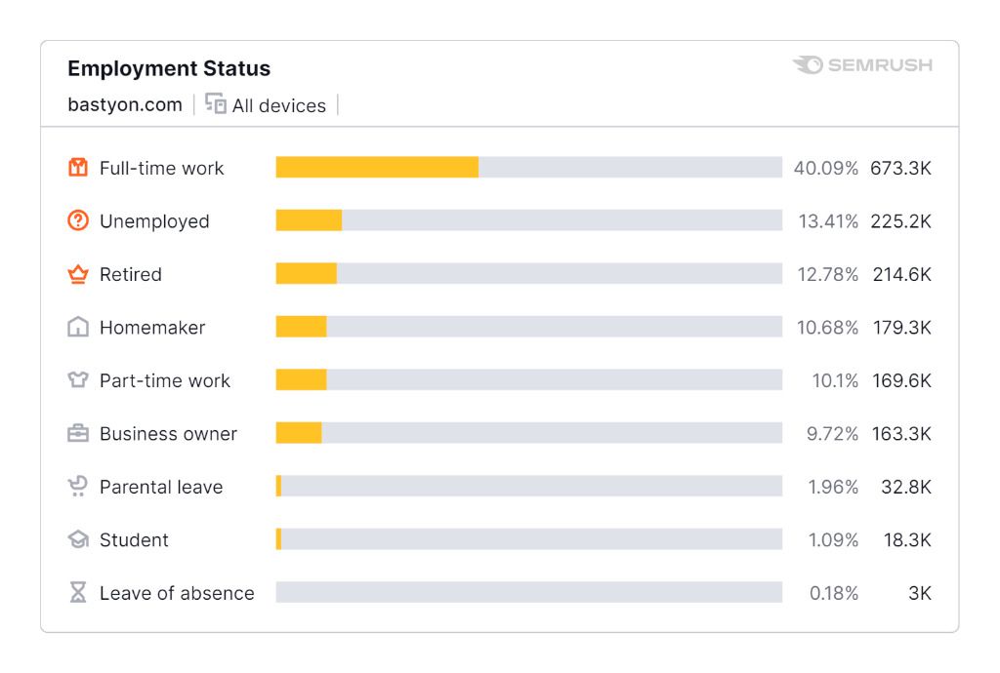
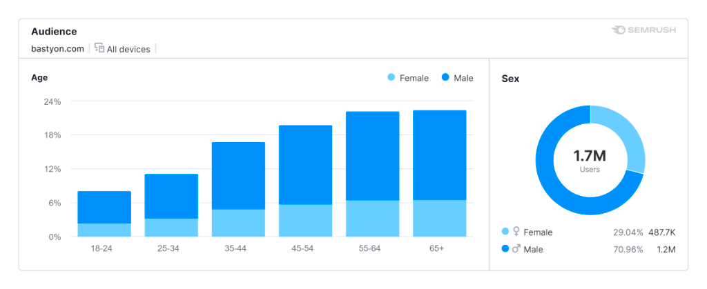
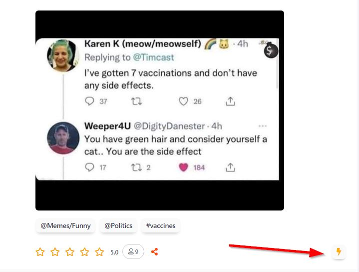
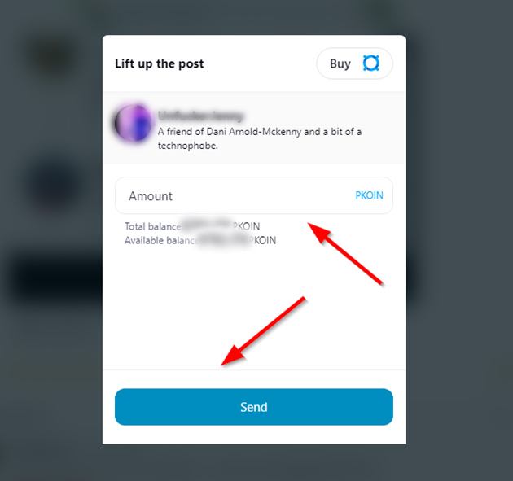

# Ways to Monetize

Bastyon, a decentralized social media platform, offers various opportunities for users to monetize their content and engagement. Here are some effective ways to make money on Bastyon

## Advertisers
Advertisers on Bastyon have accesss to one of the best CPM (cost per thousands impressions) in the industry for large networks. On Bastyon you can get to about **¢29 cents as opposed to the industry's avergae over $1**. Checkout [Calculations page](advertisement-cpm-calculation.md) for details on the calculations.

todo: advertise on bastyon video goes here

<iframe width="640" style="aspect-ratio:1.7770833333333333" src="https://bastyon.com/embedVideo.php?embed=true&amp;autoplay=true&amp;s=2cdab966cf0cce28b52597a42d9f4290489b120a2ec64a09e6a6650ffb090f66&amp;host=peertube23.pocketnet.app&amp;id=cf7b0d22-6d10-46bc-bb9b-de6d51482153" frameborder="0" allow="accelerometer; autoplay; clipboard-write; encrypted-media; gyroscope; picture-in-picture" allowfullscreen=""></iframe>

    

        

            <ul>
                <li>Are you trying to be heard on the internet?</li>
                <li>Would you like to get your content or product in front of a new dynamic audience for less than major ad networks?</li>
            </ul>
        

        

            <ul>
                <li>Bastyon, the blockchain social network has just released a way of promoting content, including videos.</li>
                <li>The cost of an impression on Bastyon is many times lower than on traditional ad networks.</li>
            </ul>
        

    

 Distribution by Country

Employment Status

Usage Demographics

### How to Start Advertising

1. Launching ads on Bastyon is very simple. To do this, you need:
2. Prepare an advertising publication (video, post or article)
3. [Buy PKOIN](buying-pkoin.md)
4. Deposit the required amount of PKOIN to start advertising

#### Click the lightning bolt icon in the lower right corner of the selected post

#### Enter PKOIN in the "Amount" field and click "Send"

#### Congratulations! You have launched an advertisement on Bastyon!

To learn more about advertisement, you can check out this [article](https://night.bastyon.com/monetization)

## Authors: Content Creators

## Node Runners
