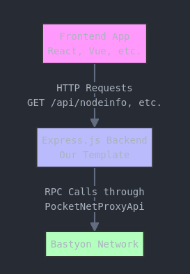

# Начало работы

# Документация по API Bastyon Pocketnet Proxy

## Обзор
API Bastyon Pocketnet Proxy предоставляет разработчикам инструменты для создания и интеграции приложений в экосистему Bastyon. Это руководство объясняет, как безопасно и эффективно использовать наши RPC методы с поддержкой TypeScript.

Инструкции по настройке предполагают, что у вас есть фронтенд, который будет вызывать бэкенд-контроллеры, определенные ниже.

Высокоуровневая диаграмма типичного приложения выглядит следующим образом:

<div style="text-align: center;">
    
</div>

## Настройка и инициализация

До тех пор, пока API прокси не будет доступен через npm, мы рекомендуем использовать наш шаблонный проект: [Bastyon Mini-App Express.js Template][template-link].

Следующие инструкции предполагают, что вы установили папку /lib, содержащую SDK pocketnet-proxy-api.

Что это означает: Сначала вам нужно будет клонировать наш шаблонный репозиторий, так как он содержит все необходимые файлы и конфигурации для быстрого начала работы.

[template-link]: https://github.com/DaniilKimlb/bastyon-miniapp-expressjs-template

```typescript
import express from 'express';
import type { Request, Response } from 'express';
import { PocketNetProxyApi } from '../lib';
import type { 
  GetNodeInfoParams,
  GetUserProfileParams,
  SearchParams 
} from '../lib/rpc.types';

const app = express();
```

## Управление экземпляром API
Что это означает: Мы используем паттерн Singleton для управления единым экземпляром API во всем приложении. Этот подход более эффективен и предотвращает множественные ненужные подключения.

```typescript
// lib/index.ts
import PocketNetProxyApi from './pocketnet-proxy-api';

let pocketNetProxyInstance: PocketNetProxyApi | null = null;

export async function getPocketNetProxyInstance(): Promise<PocketNetProxyApi> {
  if (!pocketNetProxyInstance) {
    pocketNetProxyInstance = await PocketNetProxyApi.create();
  }
  return pocketNetProxyInstance;
}

export { PocketNetProxyApi };
```

## Обработчики маршрутов
Что это означает: Это эндпоинты, которые ваше приложение будет предоставлять для обработки различных типов запросов. Каждый обработчик отвечает за конкретную функцию, такую как получение информации о ноде или профилей пользователей.

### Получение информации о ноде
Что это означает: Этот эндпоинт получает текущий статус и информацию о ноде сети Bastyon, что полезно для мониторинга и диагностики.

```typescript
// controllers/node.controller.ts
import type { Request, Response } from 'express';
import { getPocketNetProxyInstance } from '../lib';

/**
 * GET /nodeinfo
 * 
 * Получает информацию о ноде из сети Bastyon.
 * Использует RPC метод getnodeinfo для получения текущего статуса ноды.
 *
 * @param {Request} req - Объект запроса Express
 * @param {Response} res - Объект ответа Express
 * @returns {Promise<void>} JSON ответ с информацией о ноде
 *
 * @example
 * // Регистрация маршрута
 * app.get('/nodeinfo', getNodeInfo);
 *
 * // Успешный ответ
 * {
 *   "message": "Информация о ноде успешно получена",
 *   "data": {
 *     // Объект информации о ноде
 *   }
 * }
 */
export async function getNodeInfo(
  req: Request, 
  res: Response
): Promise<void> {
  try {
    const api = await getPocketNetProxyInstance();
    const result = await api.rpc.getnodeinfo();

    res.status(200).json({
      message: 'Информация о ноде успешно получена',
      data: result
    });
  } catch (error) {
    res.status(500).json({
      message: 'Не удалось получить информацию о ноде',
      error: error instanceof Error ? error.message : 'Неизвестная ошибка'
    });
  }
}
```

### Получение профиля пользователя
Что это означает: Этот эндпоинт получает информацию о конкретном пользователе, используя его блокчейн-адрес. Обычно используется для отображения деталей пользователя и верификации.

```typescript
// controllers/user.controller.ts
import type { Request, Response } from 'express';
import { getPocketNetProxyInstance } from '../lib';
import type { GetUserProfileParams } from '../lib/rpc.types';

/**
 * GET /user/:address
 * 
 * Получает информацию о профиле пользователя для заданного адреса.
 *
 * @param {Request} req - Объект запроса Express с параметром address
 * @param {Response} res - Объект ответа Express
 * @returns {Promise<void>} JSON ответ с профилем пользователя
 *
 * @example
 * // Регистрация маршрута
 * app.get('/user/:address', getUserProfile);
 *
 * // Успешный ответ
 * {
 *   "message": "Профиль пользователя успешно получен",
 *   "data": {
 *     // Объект профиля пользователя
 *   }
 * }
 */
export async function getUserProfile(
  req: Request, 
  res: Response
): Promise<void> {
  try {
    const { address } = req.params;
    const api = await getPocketNetProxyInstance();
    
    const result = await api.rpc.getuserprofile({
      address,
      shortForm: "basic"
    } satisfies GetUserProfileParams);

    res.status(200).json({
      message: 'Профиль пользователя успешно получен',
      data: result
    });
  } catch (error) {
    res.status(500).json({
      message: 'Не удалось получить профиль пользователя',
      error: error instanceof Error ? error.message : 'Неизвестная ошибка'
    });
  }
}
```

### Поиск контента
Что это означает: Этот эндпоинт позволяет пользователям искать контент на платформе с поддержкой пагинации для эффективной обработки больших наборов результатов.

```typescript
// controllers/search.controller.ts
import type { Request, Response } from 'express';
import { getPocketNetProxyInstance } from '../lib';
import type { SearchParams } from '../lib/rpc.types';

/**
 * GET /search
 * 
 * Поиск контента с поддержкой пагинации.
 * 
 * @param {Request} req - Объект запроса Express с параметрами запроса
 * @param {Response} res - Объект ответа Express
 * @returns {Promise<void>} JSON ответ с результатами поиска
 *
 * @example
 * // Регистрация маршрута
 * app.get('/search', searchContent);
 *
 * // Запрос
 * GET /search?keyword=blockchain&page=1&pageSize=20
 *
 * // Успешный ответ
 * {
 *   "message": "Поиск успешно завершен",
 *   "data": {
 *     "results": [],
 *     "total": 0
 *   }
 * }
 */
export async function searchContent(
  req: Request, 
  res: Response
): Promise<void> {
  try {
    const { 
      keyword, 
      page = '0', 
      pageSize = '20' 
    } = req.query;

    const api = await getPocketNetProxyInstance();
    
    const result = await api.rpc.search({
      keyword: String(keyword),
      type: "content",
      pageStart: Number(page),
      pageSize: Number(pageSize)
    } satisfies SearchParams);

    res.status(200).json({
      message: 'Поиск успешно завершен',
      data: result
    });
  } catch (error) {
    res.status(500).json({
      message: 'Операция поиска не удалась',
      error: error instanceof Error ? error.message : 'Неизвестная ошибка'
    });
  }
}
```

### Экспорт контроллеров
Что это означает: Этот файл централизует все обработчики маршрутов (контроллеры) в одном месте для лучшей организации и поддерживаемости.

```typescript
// controllers/index.ts
export * from './node.controller';
export * from './user.controller';
export * from './search.controller';
```

### Регистрация маршрутов
Что это означает: Здесь вы определяете, какие URL-адреса вызывают какие обработчики в вашем приложении. Это сопоставляет URL-адреса с соответствующими функциями.

```typescript
// routes/index.ts
import express from 'express';
``` 