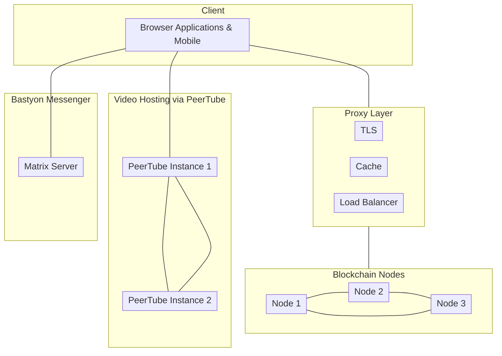

# Обзор платформы
 
Добро пожаловать в документацию разработчика Bastyon. Здесь вы найдете много полезной информации, включая руководство по началу работы, обзор архитектуры платформы, а также справочник по API.

Bastyon - это инновационная социальная сеть с открытым исходным кодом и платформа для обмена видео, созданная с приоритетом на свободу слова и конфиденциальность пользователей. В отличие от традиционных социальных сетей, Bastyon работает без централизованного корпоративного контроля, опираясь на распределенную сеть узлов по всему миру. Для получения дополнительной информации вы можете ознакомиться с разделом [начало работы](/get-started.md) документации.

> **Видение:**
Bastyon стремится создать устойчивую децентрализованную экосистему, которая предоставляет людям неограниченный доступ к коммуникации, информации и управлению персональными данными. Наше видение заключается в создании платформы, которая успешно противостоит цензуре и обеспечивает суверенитет пользователей в цифровом пространстве.

Платформа работает на распределенной сети узлов, использующих блокчейн Bastyon, который основан на рандомизированном алгоритме Proof-of-Stake. Эта децентрализованная архитектура гарантирует, что ни одна организация не может контролировать или цензурировать платформу.
Интеграция криптовалюты.
Bastyon использует собственную криптовалюту, [PKOIN](https://www.coingecko.com/en/coins/pocketcoin+), для стимулирования создателей контента и операторов узлов.

## Архитектура и дизайн

Архитектура потока приложения в значительной степени зависит от контента, с которым взаимодействуют пользователи. На высоком уровне архитектура Bastyon выглядит следующим образом:


<!-- bastyon-architecture-overview diagram mermaid code 


-->
<!-- Add more architectural detail as needed -->

<!-- todo
Describe the Bastyon implementaiton in terms of its building blocks. It should be high-level, explaining the architecture diagram from above in a bit more detail.
-->

## Репозитории разработки

Платформа Bastyon примерно разделена на Roadmap (новые идеи и план развития для идей, вышедших из стадии идеации), документацию, фронтенд-компонент (мобильные приложения, десктопное и веб-браузерное приложение), бэкенд-компонент (программное обеспечение узла, обозреватель блокчейна, API платформы Bastyon и todo: что такое control?)

Ниже представлены репозитории для каждого компонента платформы
<!--
[todo] provide detailed descriptions for each repo
-->

### Обзор проекта Bastyon 
[https://github.com/pocketnetteam/get.started](https://github.com/pocketnetteam/get.started)

[отслеживание работы](https://github.com/pocketnetteam/get.started/issues/1)

### План развития 
[https://github.com/pocketnetteam/roadmap](https://github.com/pocketnetteam/roadmap)

[отслеживание работы](https://github.com/pocketnetteam/roadmap/issues/1)

### Документация

[https://github.com/pocketnetteam/documentation](https://github.com/pocketnetteam/documentation)

### Фронтенд

#### Пользовательский интерфейс приложения Bastyon

[https://github.com/pocketnetteam/pocketnet.gui](https://github.com/pocketnetteam/pocketnet.gui)

#### Реализация видео Bastyon
[https://github.com/pocketnetteam/bastyon-video](https://github.com/pocketnetteam/bastyon-video)

#### Пользовательский интерфейс мессенджера Bastyon

[https://github.com/pocketnetteam/bastyon-chat](https://github.com/pocketnetteam/bastyon-video)

#### Пользовательский интерфейс звонков Bastyon 

[https://github.com/pocketnetteam/bastyon-calls](https://github.com/pocketnetteam/bastyon-video)

### Бэкенд

[https://github.com/pocketnetteam/pocketnet.core](https://github.com/pocketnetteam/pocketnet.core)

[https://github.com/pocketnetteam/pocketnet.explorer](https://github.com/pocketnetteam/pocketnet.explorer)

[https://github.com/pocketnetteam/pocketnet.api](https://github.com/pocketnetteam/pocketnet.api)

[https://github.com/pocketnetteam/pocketnet.control](https://github.com/pocketnetteam/pocketnet.control)

#### Блокчейн и сеть узлов

## Краткое руководство

### Как собрать узел локально?

[Скоро будет]

### Как собрать пользовательский интерфейс десктопного приложения локально?

[Скоро будет]

### Как собрать мессенджер локально?

[Скоро будет]

<!-- Add other howtos as needed -->

## Модерация Bastyon

### Флаги

Жалобы позволяют пользователям отмечать контент как нежелательный (пост или комментарий и автор). Жалобы могут отправлять пользователи со значком "Акула" (см. API).

Числовое значение `REASON` используется для различения жалоб:

1. Порнография
2. Педофилия - любые даже отдаленно намекающие изображения/видео/тексты с детьми или подростками
3. Прямая угроза насилия
4. Незаконные наркотики - любая положительная оценка или пропаганда незаконных наркотиков
5. Контент, защищенный авторским правом (с четким доказательством от владельца)

#### Условия создания жюри

Любой флаг может инициировать создание "жюри". Если жюри инициировано, все последующие флаги игнорируются. Для создания жюри учитываются следующие правила:

- Аккаунт не находится в активном бане
- Количество флагов с одинаковыми `REASON`, `CONTENT_TX_HASH` и `ADDRESS_HASH` должно быть `>= [main:20, test:5, reg:2]`
- Глубина поиска похожих флагов `FLAG_HEIGHT > (CURRENT_HEIGHT - [main:43200, test:4320, reg:10])`

### Транзакция

Код `OP_RETURN`

`6d6f64466c6167`

#### Структура полезной нагрузки
```json
{
    "s2": "<CONTENT_TX_HASH>",
    "s3": "<ADDRESS_HASH>",
    "i1": "<REASON>"
}
```

### Жюри

Жюри не является транзакцией, это запись в базе данных и содержит следующие поля:

- `juryid` - Хэш флага, инициирующего создание жюри.
- `accountid` - Адрес аккаунта, автора контента.
- `reason` - Числовой код причины жалобы.

Вместе с записью жюри выбираются модераторы:

- Для фильтрации списка модераторов используется хэш транзакции флага `FLAG_HASH`, инициировавшего создание жюри.
- Хэш транзакции регистрации аккаунта модератора `ACCOUNT_HASH` используется как сортировка модераторов.
- Для решения вопроса жюри выбираются TM аккаунты `[main:80, test:6 reg:4]`
- Для равномерного распределения модераторов аккаунты выбираются по следующим условиям:
  * Выбраны TM/2 аккаунтов, где `ACCOUNT_HASH < FLAG_HASH`
  * Выбраны TM/2 аккаунтов, где `ACCOUNT_HASH > FLAG_HASH`

### Голосование

Голос модератора, который имеет два значения `0|1`, указывающих, согласен ли модератор с жалобами или нет. Любой голос может инициировать вердикт жюри.

- Вердикт положительный, если голос удовлетворяет условию, что это N-й положительный голос `[main:8, test:3, reg:2]`.
- Отрицательный вердикт выносится вместе с первым отрицательным голосом любого модератора.
- После вынесения вердикта (положительного или отрицательного) все голоса игнорируются.
- Жюри без вердикта бессрочно.

#### Транзакция

Код `OP_RETURN`

`6d6f64566f7465`

#### Структура полезной нагрузки
```json
{
    "s2": "<JURY_ID>",
    "i1": "<VERDICT>"
}
```

`JURY_ID` - хэш транзакции флага, инициировавшей жюри

`VERDICT` - числовое значение `0|1`

### Бан аккаунта

Бан аккаунта, как и жюри, не является транзакцией. Это запись в базе данных и содержит следующие поля:

- Ссылка на голос, инициирующий блокировку.
- Ссылка на аккаунт, автора контента.
- Высота окончания блокировки. Период блокировки определяется на основе правил:
  * Первая блокировка - `[main:43200, test:5000, reg:100]` блоков
  * Вторая блокировка - `[main:129600, test:10000, reg:200]` блоков
  * Третья блокировка - `[main:51840000, test:15000, reg:1000]` блоков

Аккаунт, заблокированный узлом, не может создавать социальные транзакции, но может создавать денежные транзакции без ограничений.

Другие аккаунты имеют право выполнять действия с заблокированным аккаунтом (ставить оценки, комментарии и т.д.).

>***Правила скрытия контента и аккаунтов #В разработке#***: Аккаунты, которые находятся в активном жюри, забанены или имеют N активных жалоб, должны быть скрыты из ленты и поиска.

### API

#### Определение значков

Метод `getuserstate` возвращает, помимо прочего, объект `badges` со списком доступных пользователю "значков":

```json
> /rpc/getuserstate <address>

{
    "result": "success",
    "data": {
        ...
        "badges": [
            "shark",
            "moderator",
            "developer"
        ],
        ...
    }
}
```

#### Список всех жюри

```json
> /rpc/getalljury

{
    "result": "success",
    "data": [
      {
        "id": "HASH",
        "address": "Адрес профиля",
        "reason": "Числовое значение REASON",
        "verdict": "Вердикт - 0 или 1"
      },
      ...
    ]
}
```

#### Список назначенных жюри для модератора

```json
> /rpc/getjuryassigned <address> <verdict - 0|1> <topHeight> <pageStart> <pageSize> <orderBy> <desc>

{
  "result": "success",
  "data": [
    {
      "hash": "9f6cb0d0cd57d6227f38d70840eae89971bf44c74e4082914f9fd641dc573e52",
      "txid": "e32rr0d0cd57d6227f38d70840eae89971bf44c74e4082914f9fd641dc573e52",
      "id": 32,
      "address": "mzaEy5FGymhhk8bZd2NbeZiecW8ZLtVceb",
      ...
      "versions": [
          {
              "h": 1054,
              "hs": "e32rr0d0cd57d6227f38d70840eae89971bf44c74e4082914f9fd641dc573e52"
          }
      ],
      "jury": {
        "juryid": "5435230506fcb1951fd0e7384fb7cad5659a154856dd10258a8d77f243507f07",
        "height": 1064,
        "reason": 1
      }
    },
    ...
  ]
}
```

Здесь `versions` - это список хэшей транзакций отредактированных версий контента.

#### Список модераторов, назначенных в указанное жюри

```json
> /rpc/getjurymoderators <juryid>

{
    "result": "success",
    "data": [
      "Адрес профиля",
      "Адрес профиля",
      ...
    ]
}
```

#### Список банов для определенного адреса

```json
> /rpc/getbans <address>

{
  "result": "success",
    "data": [
      {
        "juryId": "HASH",
        "contentId": "HASH",
        "reason": 1,
        "ending": 2500000
      },
      {
        "juryId": "HASH",
        "contentId": "HASH",
        "reason": 2,
        "ending": 2600000
      },
      ...
    ]
}
```

#### Список банов для определенного адреса

```json
> /rpc/getbans <address>

{
  "result": "success",
    "data": [
      {
        "juryId": "HASH",
        "reason": 1,
        "ending": 2500000
      },
      {
        "juryId": "HASH",
        "reason": 2,
        "ending": 2600000
      },
      ...
    ]
}
```

#### Получение определенной версии контента

```json
> /rpc/getcontent ["HASH", "HASH", ...] <address> <LAST - 0|1>

{
  "result": "success",
    "data": [
      ...
    ]
}
```

#### Уведомление о новом жюри, назначенном автору контента

`txid` - ID транзакции флага и ID жюри

```json
{
	"addr": "TG69Jioc81PiwMAJtRanfZqUmRY4TUG7nt",
	"msg": "event",
	"txid": "0080c9a54b94b7e0602486e41c18a8f54bf3ed4b29508dbef58c20021fd5852d",
	"time": 1706521030,
	"contentHash": "cb4866f11e1ba2087364600fcd0c316373639e18223da63ddd9b6115e2313088",
	"contentRootHash": "cb4866f11e1ba2087364600fcd0c316373639e18223da63ddd9b6115e2313088",
	"contentType": "200",
	"mesType": "juryassigned",
	"reason": "2"
}
```

#### Уведомление о новом бане для аккаунта

```json
{
  "addr": "TLAvSHoNbeECY9S6Z7WBMyDT64WWHLm8d7",
  "msg": "event",
  "txid": "84858578a2ec42069dc4a0eb752c2d16229e52f65f1ccfd6de3bc77899eef71f",
  "time": 1706522294,
  "contentHash": "9a3f634be04c6ac190d01ca376711190925b819314c8dfa0753533a87ef87dea",
  "contentRootHash": "9a3f634be04c6ac190d01ca376711190925b819314c8dfa0753533a87ef87dea",
  "contentType": "200",
  "juryHash": "aeb2e47fb6dec5ebcb91299627e3f87ab37d60997f8a17c16972a4660e3de696",
  "mesType": "juryverdict",
  "reason": "1"
}
```

## Лучшие практики и примеры

## Учебные материалы