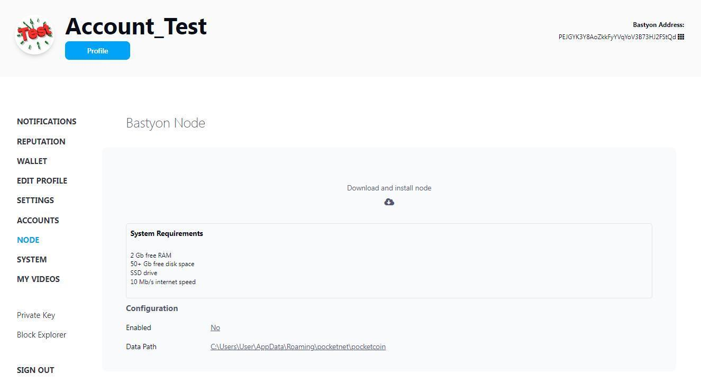

# Руководство по настройке Easy Node

## Важное уведомление

**Загружайте и устанавливайте программное обеспечение Pocketnet Team только из официальных источников!**

Официальная страница на GitHub: [https://github.com/pocketnetteam](https://github.com/pocketnetteam)

## Ссылки для скачивания

Клиентское приложение Bastyon / Brighteon для персональных компьютеров (с возможностью установки Easy Node):
- GitHub: [https://github.com/pocketnetteam/pocketnet.gui/releases](https://github.com/pocketnetteam/pocketnet.gui/releases)

Варианты загрузки:
- Для Windows: BastyonSetup.exe
- Для Linux: BastyonSetup.deb

> **Важные примечания:**
> - Узел имеет собственный кошелек и не связан с аккаунтом
> - **Не депозитируйте Pocketcoin в кошелек узла, пока полностью не настроите узел и не сделаете резервную копию кошелька узла!**

## Системные требования

# Руководство по системным требованиям узла Bastyon

## Обзор

Это руководство описывает системные требования для узла Bastyon, который будет функционировать как публичный узел для обслуживания фронтенда Bastyon, включая возможности кошелька и стейкинга монет.

> **Важное примечание:** Требования к узлу могут меняться по мере роста сети.

## Системные требования

### Минимальные требования

| Компонент | Спецификация |
|-----------|---------------|
| ОС        | Windows 7 или выше (64 бит) / Linux (Debian, Ubuntu, Mint и т.д.) (64 бит) |
| Процессор | 2-ядерный x86-64 CPU |
| ОЗУ       | 4 ГБ |
| Интернет  | 10 Мбит |
| Хранилище | 150 ГБ* свободного места на SSD для хранения блокчейна |

### Рекомендуемые требования

| Компонент | Спецификация |
|-----------|---------------|
| ОС        | Windows 7 или выше (64 бит) / Linux (Debian, Ubuntu, Mint и т.д.) (64 бит) |
| Процессор | 4-ядерный x86-64 CPU |
| ОЗУ       | 12 ГБ |
| Интернет  | - 100 Мбит  - Публично доступный IP-адрес и порты (см. раздел Настройка сети) |
| Хранилище | Те же, что и минимальные требования |

## Дополнительные примечания

1. **Рост хранилища:** 
   - Потребление дискового пространства может увеличиваться со временем из-за роста блокчейна.

2. **Начальная синхронизация:** 
   - Дополнительное свободное место на системном диске и большой объем ОЗУ требуются только во время первой синхронизации блокчейна.

3. **Устранение проблем с малым объемом ОЗУ:** 
   - Если у вас меньше ОЗУ, чем рекомендуется, и программа автоматически закрывается при первом запуске узла, увеличьте размер файла подкачки или swap-файла.

## Настройка сети

Для оптимальной работы в качестве публичного узла убедитесь, что:
- Ваш узел имеет публично доступный IP-адрес
- Необходимые порты открыты и правильно настроены (обратитесь к документации по настройке сети для конкретных требований к портам)

## Процесс установки

1. Установите клиент Bastyon/Brighteon (рекомендуется в путь по умолчанию).
2. Запустите клиент и создайте новый аккаунт Bastyon или войдите в существующий.
3. Для установки и запуска Easy Node перейдите в меню вашего аккаунта в правом верхнем углу домашней страницы Bastyon / Brighteon.

4. Перейдите в меню (Управление) - (Узел).

5. Укажите директорию для хранения файлов блокчейна (должна быть на SSD, путь только на английском языке).
6. Нажмите "Директория по умолчанию" для установки пути, затем "Загрузить и установить узел".
7. Начнется загрузка контрольной точки базы данных и ее дальнейшая распаковка.

8. Начнется процесс проверки базы данных и запуск синхронизации с сетью.

> **Обратите внимание на высоту:** Первое число = блоки на вашем узле / Второе число = блоки в сети

9. Дождитесь полной синхронизации с сетью (указывается совпадающими высотами блокчейна).

## Использование Easy Node

После установки и синхронизации окно Easy Node будет отображать:

### Синхронизация
- Статус: активен (Узел работает)
- Версия: [установленная версия узла]
- Цепь: основная
- Высота: [текущий блок в сети]
- Хеш блока: [хеш-сумма текущего блока]

### Кошелек
- Статус: [Статус узла и статус стейкинга]
- Опции управления:
  - Депозит (Добавить Pocketcoin в кошелек узла)
  - Перевод (Отправить Pocketcoin с кошелька узла)
  - Экспорт кошелька (Архивная копия приватного ключа кошелька)
  - Импорт кошелька (Восстановление кошелька с помощью приватного ключа)

### Конфигурация
- Включено: Включение/выключение узла
- Путь к данным: Рабочая директория узла
- Обновление узла: Доступная версия обновления

> **Примечание:** После выключения узла становится возможным удалить узел и рабочую директорию. **Внимание!** Не удаляйте узел, если у вас нет архивной копии кошелька узла.

## Важное управление кошельком

**Перед депозитом Pocketcoin:**
1. Экспортируйте приватный ключ кошелька и сохраните его в безопасном месте.
2. Сделайте копию файла Wallet.dat:
   - Выключите узел (Включено - нет)
   - Найдите Wallet.dat в рабочей директории узла
   - Скопируйте в несколько безопасных мест хранения
   
> **Примечание:** Копируйте файл кошелька только при выключенном узле, иначе он может быть скопирован с ошибкой.
> Достаточно одной резервной копии Wallet.dat и приватного ключа (Не нужно делать новые резервные копии после каждой транзакции).

### Депозит Pocketcoin
1. Нажмите "Депозит"
2. Используйте отображаемый публичный адрес

> **Примечание:** Новый публичный адрес генерируется каждый раз для приватности, но старые адреса остаются действительными.

### Перевод Pocketcoin
1. Нажмите "Перевод"
2. Укажите адрес перевода, сумму и плательщика комиссии
3. Нажмите "Отправить"