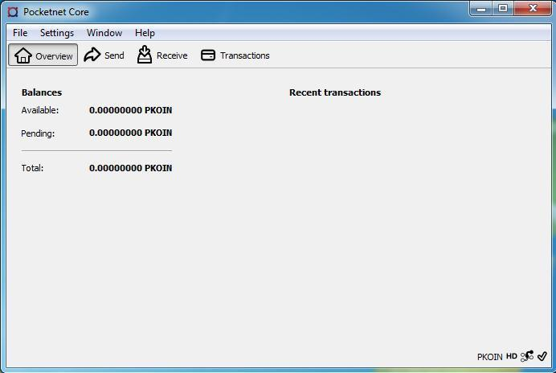

# Руководство по настройке полного узла

Это руководство содержит инструкции по настройке узла для поддержки блокчейн-сети PocketNet и децентрализованного приложения социальных медиа Bastyon. Операторы узлов PocketNet Core получают вознаграждение в криптовалюте платформы, PKOIN, участвуя в процессе, называемом стейкингом, который генерирует новые блоки в блокчейне. Для получения более подробной информации о сети PocketNet, пожалуйста, обратитесь к нашему white paper.

Социальная сеть Bastyon доступна по адресу [https://bastyon.com](https://bastyon.com)

## Системные требования

### Минимальные требования

| Компонент | Спецификация |
|-----------|---------------|
| ОС        | Windows 7 или выше (64 бит) / Linux (Debian, Ubuntu, Mint и т.д.) (64 бит) |
| Процессор | 2-ядерный процессор x86-64 |
| ОЗУ       | 4 ГБ |
| Интернет  | 10 Мбит |
| Хранилище | 150 ГБ* свободного места на SSD для хранения блокчейна |

### Рекомендуемые требования

| Компонент | Спецификация |
|-----------|---------------|
| ОС        | Windows 7 или выше (64 бит) / Linux (Debian, Ubuntu, Mint и т.д.) (64 бит) |
| Процессор | 4-ядерный процессор x86-64 |
| ОЗУ       | 12 ГБ |
| Интернет  | - 100 Мбит <br/>- Публично доступный IP-адрес и порты (см. раздел "Настройка сети") |
| Хранилище | То же, что и минимальные требования |

## Дополнительные примечания

1. **Рост хранилища:** 
   - Потребление дискового пространства может увеличиваться со временем из-за роста блокчейна.

2. **Начальная синхронизация:** 
   - Дополнительное свободное место на системном диске и большой объем ОЗУ требуются только во время первой синхронизации блокчейна.

3. **Устранение проблем с малым объемом ОЗУ:** 
   - Если у вас меньше ОЗУ, чем рекомендуется, и программа автоматически закрывается при первом запуске узла, увеличьте размер файла подкачки.

## Настройка сети

Для оптимальной работы в качестве публичного узла убедитесь, что:
- Ваш узел имеет публично доступный IP-адрес
- Необходимые порты открыты и правильно настроены (см. документацию по настройке сети для конкретных требований к портам)

## Настройка Linux (Ubuntu, Debian, Mint и т.д.)

1. Загрузите последний пакет `pocketnetcore_*_linux_x64_setup.deb` со [страницы релизов](https://github.com/pocketnetteam/pocketnet.core/releases) проекта.

2. Установите пакет с правами root. Откройте терминал в директории, куда вы загрузили установщик, и выполните команду:

   ```bash
   $ sudo dpkg -i pocketnetcore_*_linux_x64_setup.deb
   ```

3. В Ubuntu и многих дистрибутивах Linux необходимо установить лимит открытых файлов на 10000 для предотвращения ошибок. Выполните `ulimit -n` для просмотра текущего лимита открытых файлов. Установите лимит в 10000 открытых файлов командой:

   ```bash
   $ ulimit -n 10000
   ```

4. После установки запустите GUI-клиент pocketcoin из командной строки:

   ```bash
   $ pocketcoin-qt
   ```

   (Для запуска узла PocketNet Core из командной строки или в режиме без графического интерфейса обратитесь к разделу "Запуск узла без графического интерфейса из командной строки" далее в этом документе.)

На этом этапе клиент PocketNet Core начнет синхронизацию с сетью. В зависимости от производительности сети, полная синхронизация может занять от нескольких дней до недели и более. Если вам нужно запустить узел в короткие сроки, вы можете загрузить контрольную точку, следуя инструкциям в разделе [Запуск узла из снимка блокчейна](#starting-node-from-a-blockchain-snapshot) ниже. Однако рекомендуется позволить узлу синхронизироваться с сетью самостоятельно, так как это проверяет публичный блокчейн и обеспечивает дополнительную безопасность и децентрализацию. В течение этого времени узел распаковывает связанную базу данных SQL. Вы можете отслеживать процесс распаковки, наблюдая за увеличением размера рабочей директории.

## Настройка Windows

1. Загрузите установщик `pocketnetcore_*_win_x64_setup.exe` со [страницы релизов](https://github.com/pocketnetteam/pocketnet.core/releases) на GitHub.

2. Запустите установщик и следуйте инструкциям, при необходимости изменяя место установки.

3. Запустите приложение PocketNet Core из меню "Пуск" Windows. Появится предупреждение безопасности Windows для брандмауэра Защитника Windows. Выберите "Разрешить доступ", чтобы разрешить PocketNet Core через брандмауэр Защитника Windows для частных сетей.

   

4. Вам будет предложен Мастер настройки:

   

   > **Важно!** После установки программы узла и её первого запуска необходимо указать путь к рабочей директории узла!

5. Выберите "Использовать пользовательскую директорию данных" и укажите путь к рабочей директории узла, затем нажмите OK.

   

6. Программа запустится и начнет индексацию базы данных:

   

7. Клиент PocketNet Core начнет синхронизацию с сетью. В зависимости от производительности сети, полная синхронизация может занять от нескольких дней до недели и более. Для более быстрой настройки вы можете загрузить контрольную точку, следуя инструкциям в разделе [Запуск узла из снимка блокчейна](#starting-node-from-a-blockchain-snapshot) ниже. Однако рекомендуется позволить узлу синхронизироваться с сетью самостоятельно, так как это проверяет публичный блокчейн и обеспечивает дополнительную безопасность и децентрализацию.

   

8. После синхронизации запустится главное окно узла:

   

## Настройка Docker

Убедитесь, что вашему контейнеру Docker выделено достаточно CPU, памяти и дискового пространства в соответствии с разделом "Минимальные системные требования" выше. Вы можете запустить узел одной командой из Docker:

```bash
$ docker run -d \
    --name=pocketnet.main \
    -p 37070:37070 \
    -p 38081:38081 \
    -p 8087:8087 \
    -v /var/pocketnet/.data:/home/pocketcoin/.pocketcoin \ 
    pocketnetteam/pocketnet.core:latest
```

Узлом можно управлять в Docker с помощью команд `pocketcoin-cli` и `pocketcoin-tx`:

```bash
$ docker ps --format '{{.ID}}\t{{.Names}}\t{{.Image}}'
ea7759a47250    pocketnet.main      pocketnetteam/pocketnet.core:latest

$ docker exec -it pocketnet.main /bin/sh

$ pocketcoin-cli --help
$ pocketcoin-tx --help
```

Для получения дополнительной информации посетите: https://hub.docker.com/r/pocketnetteam/pocketnet.core

## Запуск узла из снимка блокчейна

Хотя рекомендуется позволить узлу PocketNet Core синхронизироваться с блокчейном самостоятельно для максимальной безопасности сети и децентрализации, вы можете использовать снимок блокчейна для запуска узла в более короткие сроки. Команда разработчиков предоставляет периодические архивы блокчейна, которые можно загрузить с https://snapshot.pocketnet.app/latest.tgz.

> **Важно:** Сделайте резервную копию вашего файла wallet.dat перед попыткой загрузки блокчейна из архива.

Используйте следующие команды оболочки bash Linux для удаления существующих данных блокчейна на диске, загрузки архива блокчейна и его извлечения в место по умолчанию:

```bash
$ cd ~/.pocketcoin
$ rm -r blocks
$ rm -r chainstate
$ rm -r indexes
$ rm -r pocketdb
$ wget https://snapshot.pocketnet.app/latest.tgz
$ tar -xzf latest.tgz -C ./
```

## Запуск узла без графического интерфейса из командной строки

Для запуска PocketNet Core в текстовом режиме из командного терминала используйте команду `pocketcoind`. В Linux вы можете запустить pocketcoind как фоновый процесс демона, используя параметр -daemon:

```bash
$ pocketcoind -daemon
```

Чтобы увидеть другие доступные опции pocketcoind:

```bash
$ pocketcoind -?
```

Вы можете отправлять команды pocketcoind с помощью программы pocketcoin-cli. Эти же команды также можно выполнять через терминал отладки pocketcoin-qt. Вот некоторые общие и полезные команды:

- Отобразить список доступных команд:
  ```bash
  $ pocketcoin-cli help
  ```

- Получить конкретную помощь по команде:
  ```bash
  $ pocketcoin-cli help "команда"
  ```

- Корректно завершить процесс pocketcoind:
  ```bash
  $ pocketcoin-cli stop
  ```

- Отобразить ваш текущий баланс PKOIN:
  ```bash
  $ pocketcoin-cli getbalance
  ```

- Сгенерировать новый адрес для получения с описательной "меткой":
  ```bash
  $ pocketcoin-cli getnewaddress "метка"
  ```

- Просмотреть список ранее сгенерированных или использованных адресов для получения:
  ```bash
  $ pocketcoin-cli listreceivedbyaddress
  ```

- Отправить сумму PKOIN на адрес:
  ```bash
  $ pocketcoin-cli sendtoaddress "адрес" сумма
  ```

- Просмотреть отчет о PKOIN, полученных через стейкинг:
  ```bash
  $ pocketcoin-cli getstakereport
  ```

- Проверить, осуществляет ли ваш узел стейкинг в данный момент:
  ```bash
  $ pocketcoin-cli getstakinginfo
  ```

- Просмотреть список подключенных пиров:
  ```bash
  $ pocketcoin-cli getpeerinfo
  ```

Pocketcoin-cli имеет возможность отправлять команды на удаленный узел для удаленного управления и работы узла без графического интерфейса. Это продвинутая тема, выходящая за рамки данного руководства; однако вы можете найти необходимые команды для удаленной работы, выполнив `pocketcoin-cli --help`.

## Устранение неполадок

Если PocketNet Core не работает, первым шагом является проверка файла debug.log в директории pocketcoin (`~/.pocketcoin` в Linux, `%HOMEPATH%\appdata\roaming\pocketcoin` в Windows). Этот файл часто содержит подсказки о том, что пошло не так с программой.

Для получения помощи по настройке узла, опубликуйте пост с тегом Bastyon/Pocknet в приложении социальных медиа Bastion.

Чтобы связаться с другими операторами узлов и быть в курсе событий и предупреждений, присоединитесь к чату владельцев узлов в Bastyon. Отправьте сообщение SnowflakeCrusher, Vortex_v или Malaka в Bastyon, чтобы быть добавленным в группу.

Для сообщения о программных дефектах и просмотра текущих проблем проверьте нашу [страницу проблем на GitHub](https://github.com/pocketnetteam/pocketnet.core/issues).

## Вклад в развитие

Мы приветствуем вклад в наши проекты на Github. Мы ищем программистов C/C++ и Javascript Node.js, а также всех, кто готов учиться. Для получения дополнительной информации ознакомьтесь с нашей документацией по [вкладу в развитие](/dev/contribution.md).