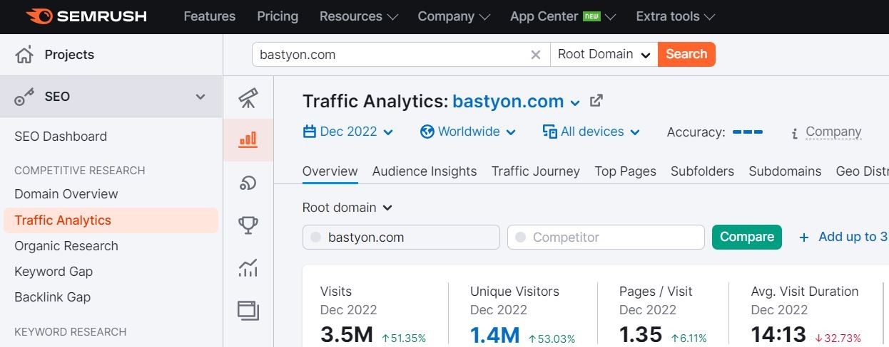

# Расчет CPM

У Bastyon около 1,63 МИЛЛИОНА уникальных посетителей в месяц. Средний посетитель заходит 5 раз в месяц, и англоязычная лента составляет 10% от Bastyon, поэтому ОБЩЕЕ КОЛИЧЕСТВО ЕЖЕМЕСЯЧНЫХ ПОСЕЩЕНИЙ = 1,65 млн * 10% * 5 = 815 000.1

1,63 млн посещений распределены по различным платформам:

| Платформа 2    | Пользователи |
|------------------|-------------|
| Bastyon.com      | 1,4 млн     |
| Android          | 130 тыс     |
| Десктопное приложение | 100 тыс    |

### Использование Bastyon.com

1,4 млн приходится на Bastyon.com (данные SEMRUSH)

### Использование десктопного приложения

Количество пользователей десктопного приложения превышает 150 000.3

### Использование Android

Количество активных пользователей Android превышает 130 000

### Использование iOS

[будет добавлено]

### Расчет CPM

1. Каждая рекламная акция длится 3 часа. Поэтому мы делим общее количество ежемесячных посещений на 30 дней и на 8, чтобы получить 3-часовые интервалы
2. Общее количество ежемесячных посещений = 815 тысяч
3. Общее количество ежедневных посещений = 27 100
4. Англоязычная лента имеет 10% всех посетителей
5. Общее количество посещений в 3-часовом интервале = 27 100/8 = 3395
6. Средняя стоимость рекламы составляет $1
7. CPM = $0,29
8. 29 центов в среднем - это очень низкий CPM

***

1По данным за декабрь 2022 года.

2 iOS изначально не был включен в расчеты

3 После каждого обновления приложения пользователи постепенно обновляют десктопное приложение, примерно половина пользователей обновляется через неделю после обновления. На изображении показано, что 76 тысяч пользователей обновили свои приложения сразу в первый день, только половина людей обновляется так быстро, поэтому реальное число составляет приблизительно 150 тысяч пользователей