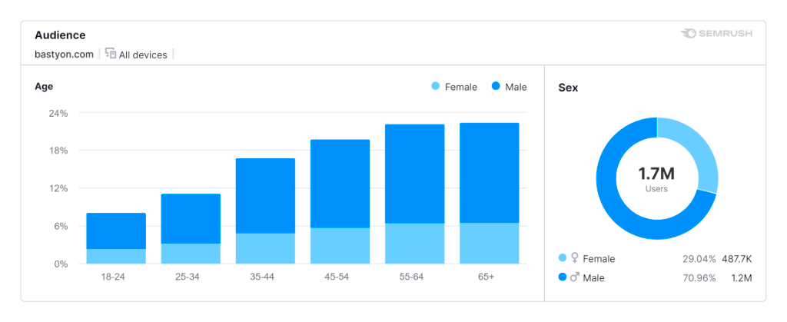

# Руководство по монетизации Bastyon

## Введение

Bastyon, децентрализованная платформа социальных медиа, предлагает различные возможности для монетизации контента и взаимодействия пользователей. Это руководство описывает эффективные способы заработка на Bastyon.

## Рекламодатели

Bastyon предлагает рекламодателям один из лучших показателей CPM (стоимость за тысячу показов) в индустрии для крупных сетей.

### Преимущества

- Конкурентный CPM: Около 29 центов по сравнению со средним показателем по отрасли более $1
- Доступ к новой, динамичной аудитории
- Продвижение контента, включая видео
- Более низкая стоимость показов по сравнению с традиционными рекламными сетями

Подробные расчеты CPM см. на [странице расчетов](assets/img/advertisement-cpm-calculation.md).

    <iframe width="640" style="aspect-ratio:1.7770833333333333" src="https://bastyon.com/embedVideo.php?embed=true&amp;autoplay=false&amp;s=2cdab966cf0cce28b52597a42d9f4290489b120a2ec64a09e6a6650ffb090f66&amp;host=peertube23.pocketnet.app&amp;id=cf7b0d22-6d10-46bc-bb9b-de6d51482153" frameborder="0" allow="accelerometer; clipboard-write; encrypted-media; gyroscope; picture-in-picture" allowfullscreen=""></iframe>

    

        

            <ul>
                <li>Пытаетесь быть услышанными в интернете?</li>
                <li>Хотите представить свой контент или продукт новой динамичной аудитории за меньшую цену, чем в крупных рекламных сетях?</li>
            </ul>
        

        

            <ul>
                <li>Bastyon, социальная сеть на блокчейне, представила способ продвижения контента, включая видео.</li>
                <li>Стоимость показа на Bastyon в несколько раз ниже, чем в традиционных рекламных сетях.</li>
            </ul>
        

    

Распределение по странам

Статус занятости

Демографические данные пользователей

### Как начать рекламировать

1. Подготовьте рекламную публикацию (видео, пост или статью)
2. [Купите PKOIN](buying-pkoin.md)
3. Внесите необходимое количество PKOIN для начала рекламы
4. Нажмите на значок молнии в правом нижнем углу выбранного поста

5. Введите количество PKOIN в поле "Сумма" и нажмите "Отправить"

**Поздравляем! Вы запустили рекламу на Bastyon!**

## Создатели контента

Bastyon считает, что создатели контента должны получать достойное вознаграждение за свою работу. На платформе запущена новая программа рекламы и монетизации для блогеров.

### Как это работает

- Рекламодатели продвигают продукты или услуги на Bastyon
- Реклама появляется в основной ленте и каналах авторов
- Доход от основной ленты идет узлам сети
- Доход от каналов авторов идет напрямую авторам

### Участники и выплаты

- Изначально монетизация работает только на верифицированных каналах авторов
- Авторы могут отключить монетизацию
- Каналы с высокой активностью будут включаться со временем
- Каналы вне Bastyon с более чем 1000 подписчиков могут запросить верификацию через [email](mailto:support@bastyon.com)

> **ВАЖНО:** Авторы зарабатывают пропорционально активности и количеству людей на их канале. Более высокая вовлеченность ведет к более высоким выплатам из рекламного пула.

### Вывод заработка

Авторы могут выводить PKOIN через биржи:
- [Tapbit.com](Tapbit.com)
- [Digifinex.com](Digifinex.com)
- [PKOIN.NET](https://pkoin.net)
- Peer-to-peer обмены в различных валютах

По вопросам вывода обращайтесь на [support@bastyon.com](mailto:support@bastyon.com).

### Расчет выплат

Заработок варьируется в зависимости от:
- Количества рекламы за неделю
- Платежей рекламодателей
- Активности канала (рейтинги и комментарии)

Активные каналы могут зарабатывать эквивалент $50-75 в неделю или больше.

### Способы увеличения заработка

- Создавайте больше контента
- Приглашайте больше людей к взаимодействию
- Фокусируйтесь на вовлеченности под постами, а не на длительности видео

**Внутренняя экономика Bastyon: Pocketcoin (PKOIN)**

## Запуск узла и стейкинг на Bastyon

Пользователи могут запустить узел Bastyon для обеспечения безопасности сети и зарабатывать PKOIN через стейкинг.

### Настройка вашего узла

Чтобы начать зарабатывать PKOIN:

1. Скачайте и установите программное обеспечение узла
   - [Руководство по настройке полного узла](/guide/full-node/)
   - [Руководство по простой настройке узла](/guide/easy-node/)
2. [Купите PKOIN](buying-pkoin.md)
3. Внесите PKOIN в кошелек вашего узла (минимум 50 PKOIN)

### Процесс стейкинга

После настройки и пополнения узла вы можете начать стейкинг.

#### Статус стейкинга

Чтобы получить статус стейкинга:

- Полный узел: Выполните команду `getstakinginfo`
- Простой узел: Проверьте раздел "Узел" в вашем приложении Bastyon

### Управление вашим PKOIN

- Отправка PKOIN: Используйте функцию "Отправить" в приложении Pocketcoin
- Получение PKOIN: Создайте запрос на оплату с QR-кодом в разделе "Получить"

## Заключение

Участвуя в экосистеме Bastyon через рекламу, создание контента или запуск узла, пользователи могут зарабатывать PKOIN, внося вклад в развитие децентрализованной платформы.