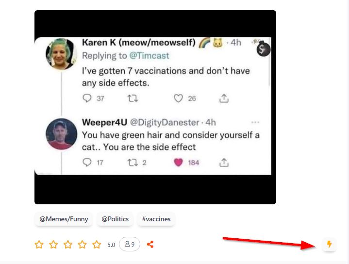

# Bastyon Monetization Guide

## Table of Contents

1. [Introduction](#introduction)
2. [Advertisers](#advertisers)
   - [Benefits](#benefits)
   - [How to Start Advertising](#how-to-start-advertising)
3. [Content Creators](#content-creators)
   - [How It Works](#how-it-works)
   - [Participants and Payouts](#participants-and-payouts)
   - [Earnings Withdrawal](#earnings-withdrawal)
   - [Payouts Calculation](#payouts-calculation)
   - [Ways to Increase Earnings](#ways-to-increase-earnings)
4. [Running a Node and Staking](#running-a-node-and-staking-on-bastyon)
   - [Setting Up Your Node](#setting-up-your-node)
   - [Staking Process](#staking-process)
   - [Managing Your PKOIN](#managing-your-pkoin)
5. [Conclusion](#conclusion)
6. [Appendix](#appendix)

## Introduction

Bastyon, a decentralized social media platform, offers various opportunities for users to monetize their content and engagement. This guide outlines the effective ways to make money on Bastyon.

## Advertisers

Bastyon offers advertisers access to one of the best CPM (cost per thousand impressions) rates in the industry for large networks.

### Benefits

- Competitive CPM: About ¢29 cents compared to the industry average of over $1
- Reach a new, dynamic audience
- Promote content, including videos
- Lower cost of impressions compared to traditional ad networks

For detailed CPM calculations, see the [Calculations page](advertisement-cpm-calculation.md).

    <iframe width="640" style="aspect-ratio:1.7770833333333333" src="https://bastyon.com/embedVideo.php?embed=true&amp;autoplay=true&amp;s=2cdab966cf0cce28b52597a42d9f4290489b120a2ec64a09e6a6650ffb090f66&amp;host=peertube23.pocketnet.app&amp;id=cf7b0d22-6d10-46bc-bb9b-de6d51482153" frameborder="0" allow="accelerometer; autoplay; clipboard-write; encrypted-media; gyroscope; picture-in-picture" allowfullscreen=""></iframe>

    

        

            <ul>
                <li>Are you trying to be heard on the internet?</li>
                <li>Would you like to get your content or product in front of a new dynamic audience for less than major ad networks?</li>
            </ul>
        

        

            <ul>
                <li>Bastyon, the blockchain social network has just released a way of promoting content, including videos.</li>
                <li>The cost of an impression on Bastyon is many times lower than on traditional ad networks.</li>
            </ul>
        

    

 Distribution by Country

Employment Status

Usage Demographics

### How to Start Advertising

1. Prepare an advertising publication (video, post, or article)
2. [Buy PKOIN](buying-pkoin.md)
3. Deposit the required amount of PKOIN to start advertising
4. Click the lightning bolt icon in the lower right corner of the selected post

5. Enter PKOIN in the "Amount" field and click "Send"

**Congratulations! You have launched an advertisement on Bastyon!**

## Content Creators

Bastyon believes that content creators should be well compensated for their work. A new advertising and monetization program for bloggers has been launched on the platform.

### How It Works

- Advertisers promote products or services on Bastyon
- Ads appear in the main feed and author channels
- Earnings from the main feed go to nodes
- Earnings from author channels go directly to the authors

### Participants and Payouts

- Initially, monetization works only on verified author channels
- Authors can disable monetization
- Channels with high activity will be included over time
- Channels outside Bastyon with over 1,000 subscribers can request verification via [email](mailto:support@bastyon.com)

> **IMPORTANT:** Authors earn proportionally to the activity and number of people on their channel. Higher engagement leads to higher payouts from the advertising pool.

### Earnings Withdrawal

Authors can withdraw PKOIN through exchanges like:
- [Tapbit.com](Tapbit.com)
- [Digifinex.com](Digifinex.com)
- [PKOIN.NET](https://pkoin.net)
- Peer-to-peer exchanges in various currencies

For withdrawal inquiries, contact [support@bastyon.com](mailto:support@bastyon.com).

### Payouts Calculation

Earnings vary based on:
- Amount of advertising in a given week
- Advertiser payments
- Channel activity (ratings and comments)

Active channels can earn the equivalent of $50-75 per week or more.

### Ways to Increase Earnings

- Create more content
- Invite more people to engage
- Focus on engagement under posts, not video length

**Internal economy of Bastyon: Pocketcoin (PKOIN)**

## Running a Node and Staking on Bastyon

Users can run a Bastyon node to secure the network and earn PKOIN through staking.

### Setting Up Your Node

To begin earning PKOIN:

1. Download and Install Node Software
   - [Full Node Setup Guide](full-node-setup.md)
   - [Easy Node Setup Guide](easy-node-setup.md)
2. [Buy PKOIN](buying-pkoin.md)
3. Deposit PKOIN to Your Node Wallet (minimum 50 PKOIN)

### Staking Process

Once your node is set up and funded, you can start staking.

#### Staking Status

To get staking status:

- Full Node: Run `getstakinginfo` command
- Easy Node: Check the Node section in your Bastyon app

### Managing Your PKOIN

- Sending PKOIN: Use the "Send" function in the Pocketcoin application
- Receiving PKOIN: Generate a payment request with a QR code in the "Receive" section

## Conclusion

By participating in Bastyon's ecosystem through advertising, content creation, or running a node, users can earn PKOIN while contributing to a decentralized platform.

## Appendix

### [Full Node Setup Guide](full-node-setup.md)

### [Easy Node Setup Guide](easy-node-setup.md)